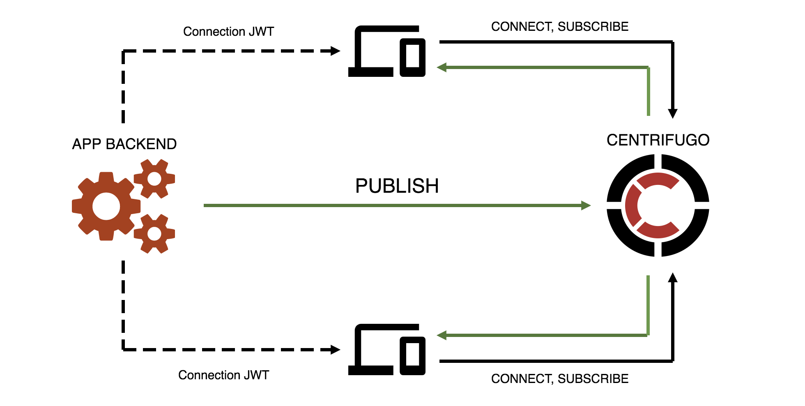

# Concepts

Centrifugo is language-agnostic real-time server. It is running as standalone server and takes care of handling persistent connections from your frontend application users. Your application backend and frontend can be written in any programming language. Your clients connect to Centrifugo from frontend using connection credentials provided by application backend, subscribe on channels. As soon as some event happens your application backend can publish message with event into channel using Centrifugo API. And that message will be delivered to all clients currently subscribed on channel. Here is a simplified scheme: 

