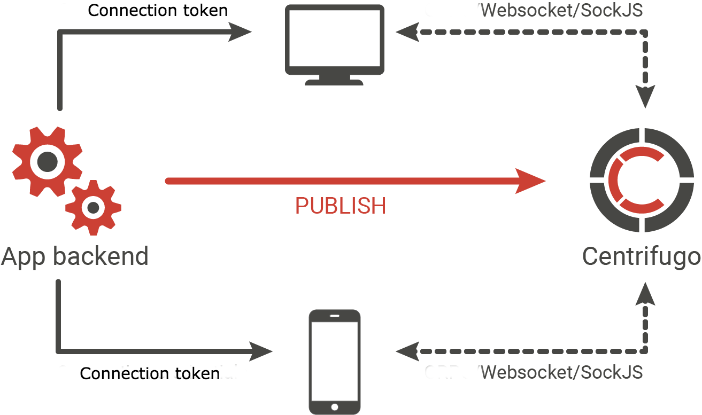

# Centrifugo integration guide

This chapter aims to help you get started with Centrifugo. We will look at a step-by-step workflow of integrating your application with Centrifugo providing links to relevant parts of this documentation.

As Centrifugo is language-agnostic and can be used together with any language/framework we won't be specific here about any backend or frontend technology your application can be built with. Only abstract steps which you can extrapolate to your application stack.

So first of all let's look again at a simplified scheme:



There are three parts involved into idiomatic Centrifugo usage scenario: your clients (frontend application), your application backend and Centrifugo. It's possible to use Centrifugo without any application backend involved but here we won't consider this use case. 

Here let's suppose you already have 2 of 3 elements: clients and backend. Now you want to add Centrifugo to receive real-time events on client side.

## 0. Install

First you need to do is download/install Centrifugo server. See [install](install.md) chapter for details.

## 1. Configure Centrifugo

Create basic configuration file with `token_hmac_secret_key` (or `token_rsa_public_key`) and `api_key` set and then run Centrifugo. See [this chapter](server/configuration.md) for details about `token_hmac_secret_key`/`token_rsa_public_key` and [chapter about API](server/http_api.md) for API description. The simplest way to do this automatically is by using `genconfig` command:

```
./centrifugo genconfig
```

– which will generate `config.json` file for you with all required fields.

A generated configuration also includes `v3_use_offset` option set to `true`. This is an option that enables using actual `offset` field in client-server protocol and will be used by default in Centrifugo v3. This option available since Centrifugo v2.5.0 and described in detail [in v2.5.0 release notes](https://github.com/centrifugal/centrifugo/releases/tag/v2.5.0).

## 2. Configure your backend

In configuration file **of your application backend** register several variables: Centrifugo secret and Centrifugo API key you set on a previous step and Centrifugo API address. By default, API address is `http://localhost:8000/api`. You **must never reveal token secret and API key to your users**.

## 3. Connect to Centrifugo

Now your users can start connecting to Centrifugo. You should get client library (see [list of available client libraries](libraries/client.md)) for your application frontend. Every library has method to connect to Centrifugo. See information about Centrifugo connection endpoints [here](https://centrifugal.github.io/centrifugo/server/configuration/#advanced-endpoint-configuration). Every client should provide connection token (JWT) on connect. You must generate this token on your backend side using Centrifugo secret key you set to backend configuration (note that in case of RSA tokens you are generating JWT with private key). See how to generate this JWT [in special chapter](server/authentication.md). You pass this token from backend to your frontend app (pass it in template context or use separate request from client side to get user specific JWT from backend side). And use this token when connecting to Centrifugo (for example browser client has special method `setToken`).

Since Centrifugo v2.3.0 there is a way to authenticate connections without using JWT - see [chapter about proxying to backend](server/proxy.md).

## 4. Subscribe to channels

After connecting to Centrifugo subscribe clients to channels they are interested in. See more about channels in [special chapter](server/channels.md). All client libraries provide a way to handle messages coming to client from a channel after subscribing to it.

Since Centrifugo v2.4.0 there is a way to subscribe connection to a list of channels on server side at the moment of connection establishment. See chapter about [server-side subscriptions](server/server_subs.md).

## 5. Publish to channel

So everything should work now – as soon as user opens some page of your application it must successfully connect to Centrifugo and subscribe to a channel (or channels). Now let's imagine you want to send a real-time message to users subscribed on a specific channel. This message can be a reaction on some event happened in your app: someone posted new comment, administrator just created new post, user pressed like button etc. Anyway this is an event your backend just got, and you want to immediately share it with interested users. You can do this using Centrifugo [HTTP API](server/http_api.md). To simplify your life [we have several API libraries](libraries/api.md) for different languages. You can publish message into channel using one of those libraries or you can simply [follow API description](server/http_api.md) to construct API request yourself - this is very simple. Also Centrifugo supports [GRPC API](server/grpc_api.md). As soon as you published message to channel it must be delivered to your client.

## 6. Deploy to production

To put this all into production you need to deploy Centrifugo on your production server. To help you with this we have many things like Docker image, `rpm` and `deb` packages, Nginx configuration. You can find more information in Deploy section of this doc. See [OS tuning](deploy/tuning.md) chapter for some actions you have to do to prepare your server machine for handling many persistent connections.

## 7. Monitor Centrifugo

Don't forget to [monitor](deploy/monitoring.md) your production Centrifugo setup.

## 8. Scale Centrifugo

As soon as you are close to machine resource limits you may want to scale Centrifugo – you can run many Centrifugo instances and load-balance clients between them using [Redis engine](server/engines.md).

## 9. Read FAQ

That's all for basics. Documentation actually covers lots of other concepts Centrifugo server has: like scalability, private channels, admin web interface, SockJS fallback, Protobuf support and more. And don't forget to read our [FAQ](faq.md).
