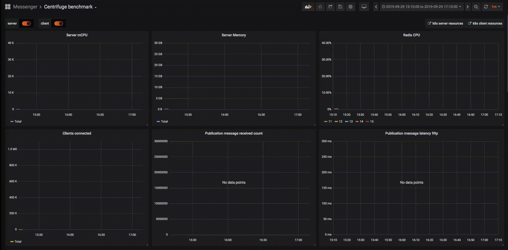

# Benchmark

In order to get an understanding about possible hardware requirements for reasonably massive Centrifugo setup we made a test stand inside Kubernetes.

Our goal was to run server based on Centrifuge library (the core of Centrifugo server) with one million WebSocket connections and send many messages to connected clients. While sending many messages we have been looking at delivery time latency. In fact we will see that about 30 million messages per minute (500k messages per second) will be delivered to connected clients and latency won't be larger than 200ms in 99 percentile.

Server nodes have been run on machines with the following configuration:

* CPU Intel(R) Xeon(R) CPU E5-2640 v4 @ 2.40GHz
* Linux Debian 4.9.65-3+deb9u1 (2017-12-23) x86_64 GNU/Linux 

Some `sysctl` values:

```
fs.file-max = 3276750
fs.nr_open = 1048576
net.ipv4.tcp_mem = 3086496	4115330	6172992
net.ipv4.tcp_rmem = 8192	8388608	16777216
net.ipv4.tcp_wmem = 4096	4194394	16777216
net.core.rmem_max = 33554432
net.core.wmem_max = 33554432
```

Kubernetes used these machines as its nodes. 

We started 20 Centrifuge-based server pods. Our clients connected to server pods using Centrifuge Protobuf protocol. To scale horizontally we used Redis Engine and sharded it to 5 different Redis instances (each Redis instance consumes 1 CPU max).

To achieve many client connections we used 100 Kubernetes pods each generating about 10k client connections to server.

Here are some numbers we achieved:

* 1 million WebSocket connections
* Each connection subscribed to 2 channels: one personal channel and one group channel (with 10 subscribers in it), i.e. we had about 1.1 million active channels at each moment.
* 28 million messages per minute (about 500k per second) **delivered** to clients
* 200k per minute constant connect/disconnect rate to simulate real-life situation where clients connect/disconnect from server
* 200ms delivery latency in 99 percentile
* The size of each published message was about 100kb

And here are some numbers about final resource usage on server side (we don't actually interested in client side resource usage here):

* 40 CPU total for server nodes when load achieved values claimed above (20 pods, ~2 CPU each)
* 27 GB of RAM used mostly to handle 1 mln WebSocket connections, i.e. about 30kb RAM per connection
* 0.32 CPU usage on every Redis instance
* 100 mbit/sec rx и 150 mbit/sec tx of network used on each server pod

The picture that demonstrates experiment (better to open image in new tab):



This also demonstrates that to handle one million of WebSocket connections without many messages sent to clients you need about 10 CPU total for server nodes and about 5% of CPU on each of Redis instances. In this case CPU mostly spent on connect/disconnect flow, ping/pong frames, subscriptions to channels.

If we enable history and history message recovery features we see an increased Redis CPU usage: 64% instead of 32% on the same workload. Other resources usage is pretty the same.

The results mean that one can theoretically achieve the comparable numbers on single modern server machine. But numbers can vary a lot in case of different load scenarios. In this benchmark we looked at basic use case where we only connect many clients and send Publications to them. There are many features in Centrifuge library and in Centrifugo not covered by this artificial experiment. Also note that though benchmark was made for Centrifuge library for Centrifugo you can expect similar results.

Read and write buffer sizes of websocket connections were set to 512 kb on server side (sizes of buffers affect memory usage), with Centrifugo this means that to reproduce the same configuration you need to set:

```json
{
    ...
    "websocket_read_buffer_size": 512,
    "websocket_write_buffer_size": 512
}
```
